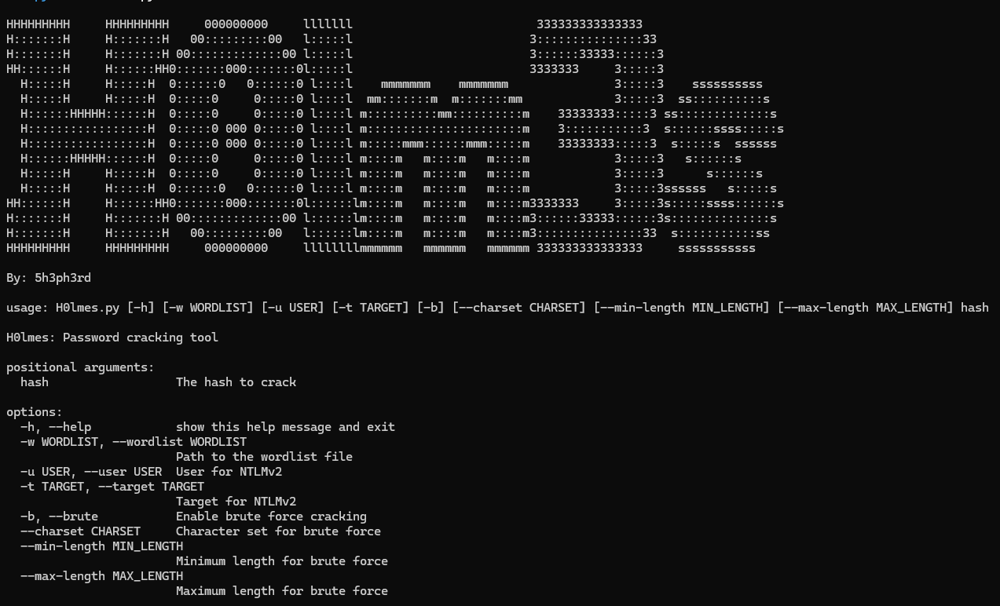
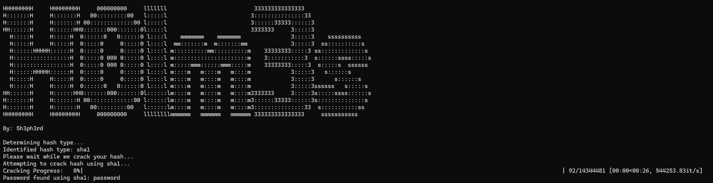

# H0lmes

H0lmes is a password-cracking tool that supports multiple hash types and brute-force attacks.

## Features

- Supports MD5, SHA1, SHA256, NTLM, NTLMv2, and more.
- Brute force and dictionary attacks.
- Rule-based wordlist generation.

## Installation

```sh
git clone https://github.com/MasterchiefGalaxy/H0lm3s.git
```

```sh
cd H0lm3s
```

```sh
pip install -r requirements.txt
```

## Example Usage

**Brute Force Attack:**

```sh
python3 H0lmes.py <hash> -b --max-length 8
```

**Dictionary Attack:**

```sh
python3 H0lmes.py <hash> -w /usr/share/wordlists/rockyou.txt
```

**NTLMv2 Attack:**

```sh
python3 H0lmes.py <ntlmv2_hash> -w /usr/share/wordlists/rockyou.txt -u <user> -t <target>
```

**Brute Force with Custom Charset:**

```sh
python3 H0lmes.py <hash> -b --charset abcdef -max-length 6
```

**Rule-Based Wordlist Generation Attack:**

```sh
python3 H0lmes.py <hash> -w /path/to/wordlist.txt --rules
```

**Help:**

```sh
python3 H0lmes.py -h
```

## Screenshots




